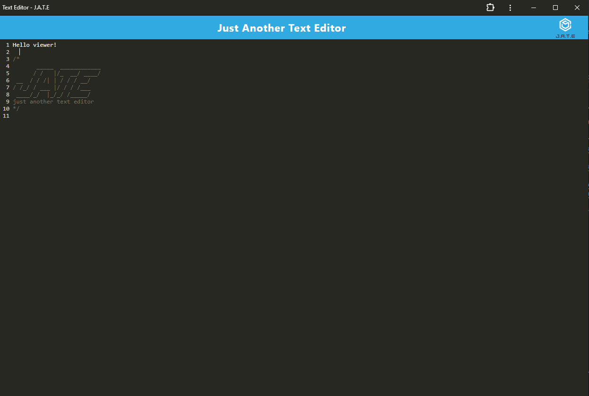

# Progressive Web Applications (PWA): Text Editor

## Description

This text editor is a progressive web application that runs in the browser, runs offline, and can be installed onto the local machine.It uses IndexedDB and local storage for data storage to insure stored data persistence.

This application has been deployed to render an can be accessed here:
[https://cantharellus-cibarius.onrender.com/](https://cantharellus-cibarius.onrender.com/)

## Table of Contents

- [Product Demonstration](#product-demonstration)
- [Installation](#installation)
- [Usage](#usage)
- [Technologies used](#technologies-used)
- [Contributing](#contributing)
- [Tests](#tests)
- [Questions](#questions)
- [License](#license)

## Product Demonstration

## Installation

To run the application locally:

- clone or download the repository.
- run the following commands in the terminal:

> - npm init
>    
> - npm i
>    
> - npm run start

## Usage

Once the application is running, you can click on the INSTALL! button to install the app onto your local machine.

To uninstall the app, follow the instructions on PWA uninstallation that are specific to your browser.

## Technologies used

- Mini-CSS-Extract Plugin
- Webpack+Workbox
- Concurrently
- JavaScript
- IndexedDB
- Express
- NodeJS
- Babel

## Contributing

Please see contact information below if you's like to contribute to this project.

## Tests

N/A

## Questions

Any questions regarding this project can be directed to:

- Email: [tp4458@gmail.com](tp4458@gmail.com)
- GitHub [TP4458](https://github.com/TP4458)

## License

This product is licensed with Apache 2.0 License. Please click on the badge below, or at the top of this document to find out more.

